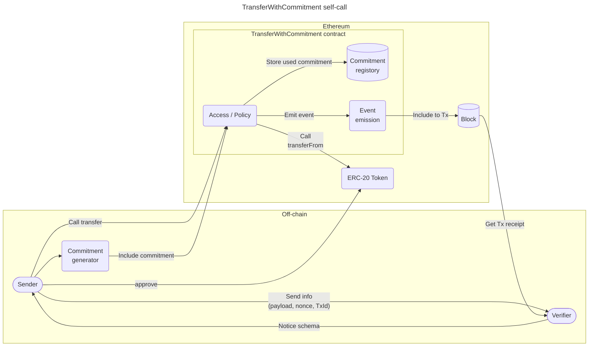
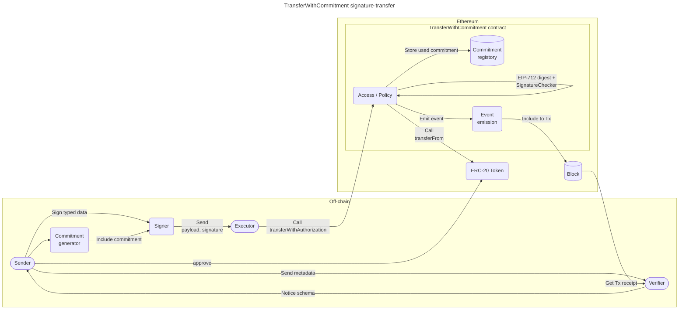
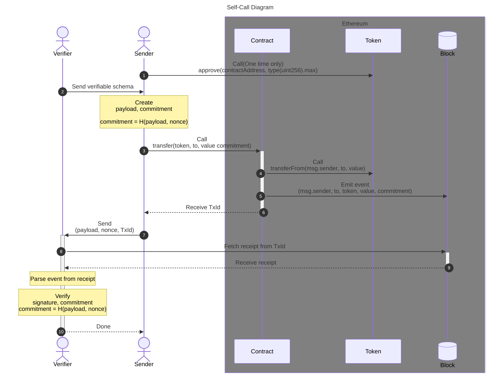
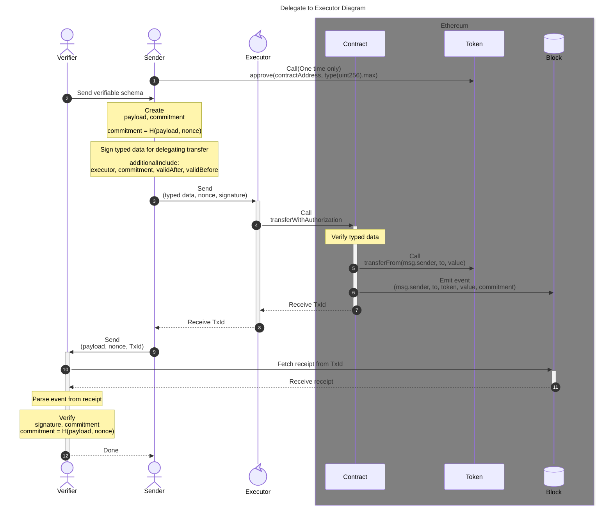
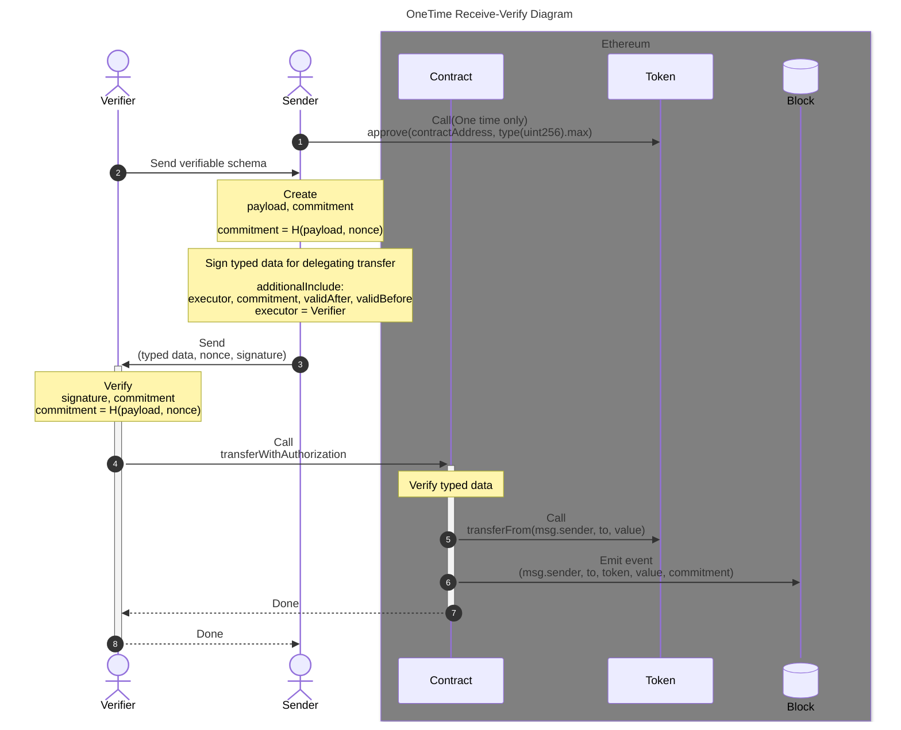

# TransferWithCommitment

任意のコミットメントともにERC20トークンを送金したことを証明

| directory    | summary          |
| ------------ | ---------------- |
| `/contracts` | コントラクト実装 |
| `/sdk_js`    | Javascript SDK   |
| `/sdk_rust`  | Rust SDK         |

### Features

- 任意のcommitmentをオンチェーンで結びつけた送金、commitmentの生成schemaと元データとtxidを知る者のみが検証できる
- 各送金情報ごとにcommitmentを含めるバッチ送金
- 複数の送金情報にまとめて一つのcommitmentに結びつけるUnifiedTransfers

### Requirements

- 送金者の署名は1回だけ
- 送金情報と任意のコミットメントを含めたイベントを発行すること
- コミットメントには唯一性があること
- schemaと元データとtxidを知る者ならばいつでも検証可能であること

### Constraints

- 資金決済法上の交換業や電取業などに抵触しないこと
  - 他人のために他人の資産をカストディしない
  - 暗号資産や電子決済手段の売買をしない
  - 投資勧誘や取引の斡旋をしない

## OVERVIEW

### Self-Call

### Signature-Transfer

## SEQUENCE

### Self-Call

### Delegate to Executor

### OneTime Receive-Verify

## Development

ローカルの CI 再現と SDK 結合テストは、すべてリポジトリルートの [`docker/compose.yml`](docker/compose.yml) が提供する隔離コンテナで実行する。ホスト側の必要要件は **`docker` + `docker compose`（v2）のみ** で、`forge` / `anvil` / `cast` / `slither` / `bun` / `cargo` / `python` / `uv` などのホストインストールは不要。

| 目的 | コマンド |
|------|---------|
| contracts の CI（forge fmt/build/test + slither） | `./scripts/ci-contracts.sh` |
| Slither 監査バンドルのみ | `./scripts/slither.sh` |
| sdk_js 結合テスト（anvil + デプロイ + bun test） | `./scripts/test-sdk-js-integration.sh` |
| sdk_rust 結合テスト（anvil + デプロイ + cargo test） | `./scripts/test-sdk-rust-integration.sh` |
| キャッシュ・ボリュームを全て破棄 | `docker compose -f docker/compose.yml down -v` |

GitHub Actions（[.github/workflows/contracts-ci.yml](.github/workflows/contracts-ci.yml)）も同じ compose サービスを呼び出すため、ローカルと CI のフローは一致する。
