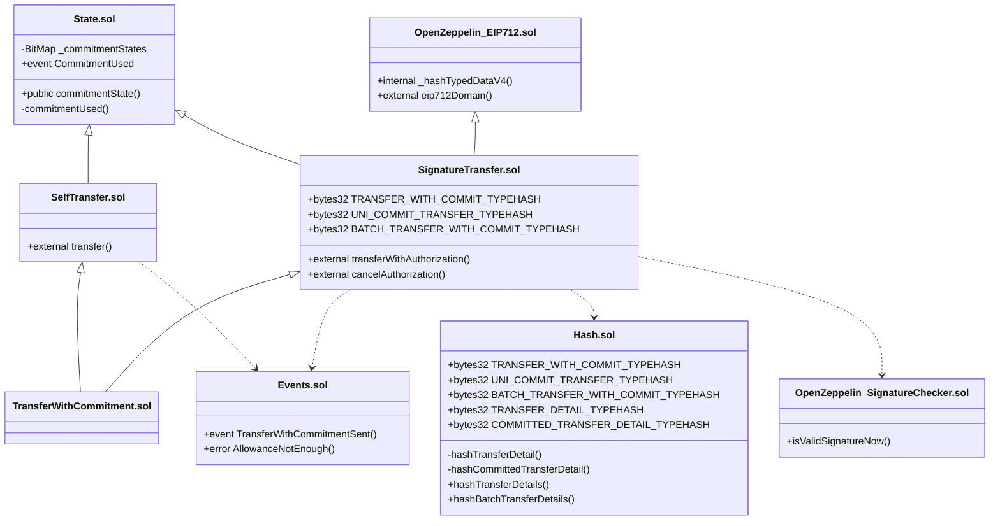

# CONTRACT IMPLEMENTATION

## Overview

図中の `OpenZeppelin_*.sol` は `@openzeppelin/contracts` のライブラリを指す便宜上の表記であり、リポジトリ内の実ファイル名ではない。

- ### TransferWithCommitment.sol

  最終的な派生コントラクトである。`SelfTransfer.sol` と `SignatureTransfer.sol` を継承する。

- ### State.sol

  コミットメントに対するリプレイ攻撃を防ぐための状態管理コントラクトである。

- ### Events.sol

  トランザクションとコミットが正常に完了したときに発行するイベント、および allowance 不足時に用いるエラーを定義する。

- ### SelfTransfer.sol

  送金者が呼び出してトークン送金を開始しコミットメントを紐づけるコントラクトである。

  `State.sol` と `@openzeppelin/contracts/utils/ReentrancyGuard.sol` を継承し、`Events.sol` を用いる。

- ### SignatureTransfer.sol

  EIP-712 に基づくオフチェーン署名により、指定アドレス（executor）へのトークン送金とコミットメントの実行権限を委任するコントラクトである。

  署名検証は `@openzeppelin/contracts/utils/cryptography/SignatureChecker.sol` の `isValidSignatureNow` により**コントラクト内で**行い、**EOA（ECDSA）**および **ERC-1271** の署名者に対応する。別の verifier コントラクト、`Ownable`、`updateVerifier` は**ない** — デプロイ後の実装は**イミュータブル**であり、オンチェーンで検証ロジックを差し替えるガバナンス面は持たない。

  耐量子（PQ）署名アルゴリズムは本デプロイメントでは**差し替え不可**である。将来 Ethereum 側で PQ 標準が定まった場合は、ハッシュ／署名の前提を更新した**再デプロイ**（または後継コントラクト）を想定する。

  継承:
  - `State.sol`
  - `@openzeppelin/contracts/utils/cryptography/EIP712.sol`
  - `@openzeppelin/contracts/utils/ReentrancyGuard.sol`

  使用: `Events.sol`、`Hash.sol`。

- ### Hash.sol
  `Structs.sol` における EIP-712 の TypeHash 定義および値のエンコード・ハッシュ化を扱うライブラリであり、`SignatureTransfer.sol` から利用される。

## Requirements

以下は `src` 配下の実装に基づく、各関数（`internal` / `private` / `modifier` を含む）の**前提条件**・**事後条件**・**アクション**の定義である。記法上、変数に関する条件は「その呼び出しが成功するために満たされること（または revert 時に満たされないこと）」として読む。OpenZeppelin 継承（`EIP712` / `ReentrancyGuard` 等）の公開 API は本節では対象外とする。

---

### `TransferWithCommitment.sol`

| 対象                         | 前提条件                 | 事後条件                                                                                                                   | アクション                                    |
| ---------------------------- | ------------------------ | -------------------------------------------------------------------------------------------------------------------------- | --------------------------------------------- |
| `constructor(name, version)` | デプロイ時に呼び出し可能 | コントラクトがデプロイされ、`SignatureTransfer` のコンストラクタ経由で EIP-712 ドメイン（`name`, `version`）が初期化される | `SignatureTransfer(name, version)` を実行する |

---

### `State.sol`

| 対象                                                  | 前提条件                                                                                                       | 事後条件                                                                                                                                                                    | アクション                                              |
| ----------------------------------------------------- | -------------------------------------------------------------------------------------------------------------- | --------------------------------------------------------------------------------------------------------------------------------------------------------------------------- | ------------------------------------------------------- |
| `commitmentUsed(from, commitment)`（`private`）       | （呼び出し元が保証）`replayGuard` から、直前に `!commitmentState(from, commitment)` が成立した後にのみ呼ばれる | `BitMaps` により `_commitmentStates[from]` の `uint256(commitment)` ビットがセットされる                                                                                    | `CommitmentUsed(from, commitment)` を emit する         |
| `commitmentState(payer, commitment)`（`public view`） | なし                                                                                                           | 戻り値は `_commitmentStates[payer]` における `uint256(commitment)` ビットの値（使用済みなら `true`）                                                                        | ストレージを読むのみ                                    |
| `replayGuard(from, commitment)`（`modifier`）         | `!commitmentState(from, commitment)`（満たさなければ revert）                                                  | 修飾された関数本体の実行前に、`commitmentUsed` により当該 `(from, commitment)` が使用済みとなる（本体が revert した場合はトランザクション全体が巻き戻るため永続化されない） | `commitmentUsed` を実行したうえで `_`（本体）を実行する |

---

### `Events.sol`

イベント `TransferWithCommitmentSent` およびカスタムエラー `AllowanceNotEnough` は関数ではないため、ここでは**意味**のみ記す。

| 対象                                                             | 意味                                                                                                 |
| ---------------------------------------------------------------- | ---------------------------------------------------------------------------------------------------- |
| `TransferWithCommitmentSent(from, to, token, value, commitment)` | 送金成功後に発行され、送金者・受取人・トークン・金額・コミットメントをログに残す。                   |
| `AllowanceNotEnough(token, from, value)`                         | 当該 `from` が本コントラクトに対して `value` 以上の allowance を持たないときに revert で用いられる。 |

---

### `SelfTransfer.sol`

| 対象                                                             | 前提条件                                                                                                                                           | 事後条件                                                                                                                                                     | アクション                                                               |
| ---------------------------------------------------------------- | -------------------------------------------------------------------------------------------------------------------------------------------------- | ------------------------------------------------------------------------------------------------------------------------------------------------------------ | ------------------------------------------------------------------------ |
| `transfer(token, to, value, commitment)`                         | `nonReentrant` により再入可能性がないこと                                                                                                          | 成功時、`_transferWithGuard` と同等の効果                                                                                                                    | `_transferWithGuard(token, to, value, commitment)` を呼ぶ                |
| `transfer(details[], commitment)`                                | `nonReentrant`；`require(details.length > 0)`（空配列は revert）；`replayGuard(msg.sender, commitment)` により `(msg.sender, commitment)` が未使用 | 成功時、各要素について `_transfer` が実行され、同一 `commitment` で複数回の `TransferWithCommitmentSent` が emit される（コミットメントは先頭で 1 回マーク） | `details` を順に `_transfer(..., commitment)` する                       |
| `transfer(details[]` `CommittedTransferDetail)`                  | `nonReentrant`；`require(details.length > 0)`（空配列は revert）                                                                                   | 成功時、各要素の `commitment` ごとに `_transferWithGuard` が完遂する                                                                                         | 各要素について `_transferWithGuard(token, to, value, commitment)` を呼ぶ |
| `_transferWithGuard(token, to, value, commitment)`（`internal`） | `replayGuard(msg.sender, commitment)`                                                                                                              | 成功時、`_transfer` と同等かつ当該コミットメントが使用済みにマークされる                                                                                     | `_transfer` を呼ぶ                                                       |
| `_transfer(token, to, value, commitment)`（`private`）           | `IERC20(token).allowance(msg.sender, address(this)) >= value`（満たさなければ `AllowanceNotEnough`）                                               | トークンが `msg.sender` から `to` へ `value` 移転され、`TransferWithCommitmentSent` が emit される                                                           | `safeTransferFrom` を実行する                                            |

---

### `SignatureTransfer.sol`

| 対象                                                                                                             | 前提条件                                                                                                                                                                                                                                                                                     | 事後条件                                                                                                                                                                          | アクション                                                                                    |
| ---------------------------------------------------------------------------------------------------------------- | -------------------------------------------------------------------------------------------------------------------------------------------------------------------------------------------------------------------------------------------------------------------------------------------- | --------------------------------------------------------------------------------------------------------------------------------------------------------------------------------- | --------------------------------------------------------------------------------------------- |
| `constructor(name, version)`                                                                                     | デプロイ時                                                                                                                                                                                                                                                                                   | `EIP712(name, version)` が設定される（ガバナンス用の `Ownable` / `verifier` はない）                                                                                              | 親コンストラクタを実行する                                                                    |
| `validTimestamp(validAfter, validBefore)`（`modifier`）                                                          | `validAfter<=validBefore`；`block.timestamp > validAfter` かつ `block.timestamp < validBefore`（`validAfter`/`validBefore` は境界として含まれないため、ちょうどの時刻では revert）                                                                                                           | なし                                                                                                                                                                              | `_` を実行する                                                                                |
| `transferWithAuthorization(from, to, token, value, validAfter, validBefore, commitment, signature)`              | `nonReentrant`；`validTimestamp`；`replayGuard(from, commitment)`；`SignatureChecker.isValidSignatureNow(from, digest, signature)` が真（`digest` は EIP-712 で `TRANSFER_WITH_COMMIT_TYPEHASH` と各フィールドおよび `msg.sender` を含む structHash から算出）                               | 成功時、`_transfer` により送金とイベントが行われ、当該コミットメントが使用済み                                                                                                    | structHash → `_hashTypedDataV4` → 検証 → `_transfer`                                          |
| `transferWithAuthorization(from, details, validAfter, validBefore, signature)`（`CommittedTransferDetail[]`）    | `nonReentrant`；`validTimestamp`；`require(details.length > 0)`（空配列は revert）；`digest` に対し `SignatureChecker.isValidSignatureNow(from, digest, signature)` が真（`details` は `Hash.hashBatchCommittedTransferDetails(details)` と同手順で折り畳み、各 `detail.commitment` を含む） | 成功時、`_batchTransfers` が各明細ごとに `_transferWithGuard` を呼び、**各** `(from, detail.commitment)` が `State` 上で使用済みとなり、イベントにも各 `detail.commitment` が載る | `Hash.hashBatchCommittedTransferDetails(details)` → structHash → 検証 → `_batchTransfers`     |
| `transferWithAuthorization(from, details, validAfter, validBefore, commitment, signature)`（`TransferDetail[]`） | `nonReentrant`；`validTimestamp`；`require(details.length > 0)`（空配列は revert）；`replayGuard(from, commitment)`；`digest` に対し `SignatureChecker.isValidSignatureNow(from, digest, signature)` が真（`details` は `Hash.hashBatchTransferDetails(details)` と同手順で折り畳み）        | 成功時、`_unifiedTransfers` により全明細が同一 `commitment` で送金される                                                                                                          | `Hash.hashBatchTransferDetails(details)` → structHash → 検証 → `_unifiedTransfers`            |
| `_batchTransfers(from, details)`（`private`）                                                                    | 呼び出し元が署名検証済みであること                                                                                                                                                                                                                                                           | 各 `details[i]` について `_transferWithGuard` が順に成功するか、途中で revert                                                                                                     | ループで `_transferWithGuard(detail.token, from, detail.to, detail.value, detail.commitment)` |
| `_unifiedTransfers(from, details, commitment)`（`private`）                                                      | 同上（ユニファイド経路）                                                                                                                                                                                                                                                                     | 全明細が同一 `commitment` で `_transfer` される（リプレイ防止は外側の `replayGuard(from, commitment)` が既に実行済み）                                                            | ループで `_transfer(detail.token, from, detail.to, detail.value, commitment)`                 |
| `_transferWithGuard(token, from, to, value, commitment)`（`private`）                                            | `replayGuard(from, commitment)`（各明細の commitment が未使用であること）                                                                                                                                                                                                                    | 成功時、`_transfer` と同等かつ当該 `(from, commitment)` が使用済み                                                                                                                | `_transfer` を呼ぶ                                                                            |
| `cancelAuthorization(authorizer, commitment, signature)`                                                         | `nonReentrant`；`replayGuard(authorizer, commitment)`；`CANCEL_AUTHORIZATION_TYPEHASH` ベースの `digest` に対し `SignatureChecker.isValidSignatureNow(authorizer, digest, signature)` が真                                                                                                   | トークン移転は行われない；当該 `(authorizer, commitment)` が使用済みとなり、同コミットメントでの送金系は再利用できない                                                            | structHash → 検証のみ（状態は `replayGuard` 側）                                              |
| `_transfer(token, from, to, value, commitment)`（`private`）                                                     | `allowance(from, address(this)) >= value`（満たさなければ `AllowanceNotEnough`）                                                                                                                                                                                                             | `safeTransferFrom(from, to, value)` 成功後 `TransferWithCommitmentSent` が emit される                                                                                            | ERC20 送金を行う                                                                              |

---

### `Hash.sol`（ライブラリ）

| 対象                                                            | 前提条件 | 事後条件                                                                          | アクション                 |
| --------------------------------------------------------------- | -------- | --------------------------------------------------------------------------------- | -------------------------- |
| `hashTransferDetail(detail)`（`internal`）                      | なし     | `TRANSFER_DETAIL_TYPEHASH` と `to, token, value` の `abi.encode` の keccak256     | 純粋計算                   |
| `hashBatchTransferDetails(details)`（`external pure`）          | なし     | 各 `hashTransferDetail` のハッシュ配列を `abi.encodePacked` して keccak256 した値 | ループでハッシュ配列を構築 |
| `hashCommittedTransferDetail(detail)`（`internal`）             | なし     | `COMMITTED_TRANSFER_DETAIL_TYPEHASH` と明細フィールドの keccak256                 | 純粋計算                   |
| `hashBatchCommittedTransferDetails(details)`（`external pure`） | なし     | 各 `hashCommittedTransferDetail` を `encodePacked` して keccak256                 | ループでハッシュ配列を構築 |

---

### Specification

- 送金者の署名は 1 回だけ

  Self-Call 経路ではオフチェーン署名は不要（txの署名のみ）。

  委任経路では EIP-712 署名が 1回。

- 送金情報とコミットメントを含むイベント

  `TransferWithCommitmentSent` が送金ごとに発行。

- コミットメントの唯一性（再利用防止）

  `State` のビットマップと `replayGuard`。

  `CommittedTransferDetail[]` 経路（Self-Call および署名付きバッチ）では明細ごとに `replayGuard`（署名付きバッチでは `_transferWithGuard` 経由）により `(from, detail.commitment)` が検証される。

- schema・元データ・txid による検証可能性

  オンチェーンでは commitment の一意性とイベント内容を保証。

  ペイロードと schema の対応はオフチェーン。

- 耐量子化に関する方針

  PQ 署名への移行方針が固まっていないので明確な対応はできないため、現行実装は OpenZeppelin `SignatureChecker`（ECDSA / ERC-1271）を利用。

  ガバナンスリスクを鑑みて、管理者によるオンチェーンの差し替え可能な verifier は置かず **immutable** とする。

  PQ 対応が必要になったら **再デプロイ** で取り込む想定。

- カストディ等に抵触しない設計

  コントラクトは allowance に基づく `transferFrom` のみで、他人資産を預からない。

- 手数料・リベースする ERC20 は非対応

  `safeTransferFrom(from,to,value)` の「実受取額」はコントラクト側で検証できず、デフレ/リベース/手数料型ERC20トークンでは `value` と一致しない可能性があるため。
