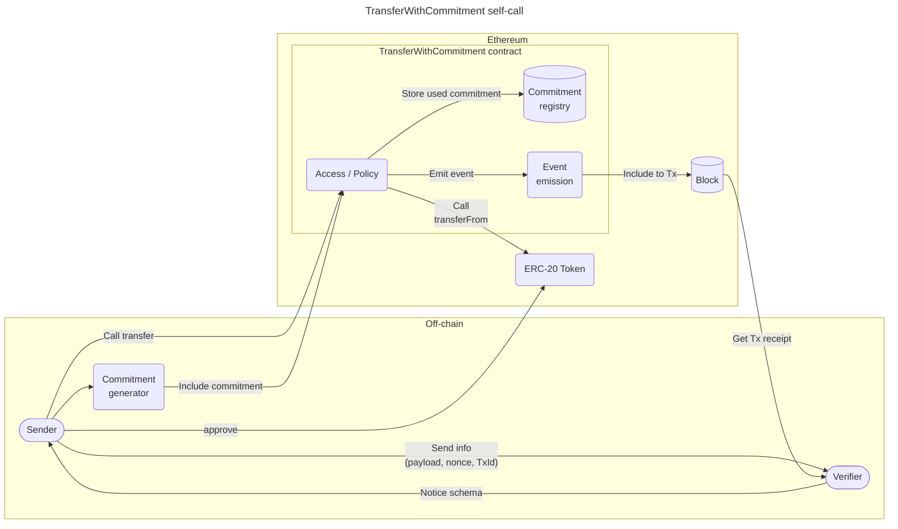
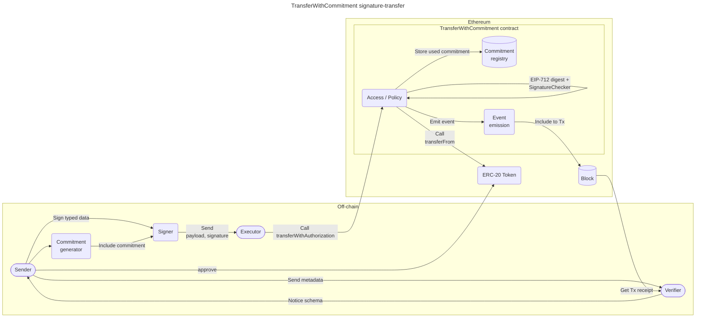
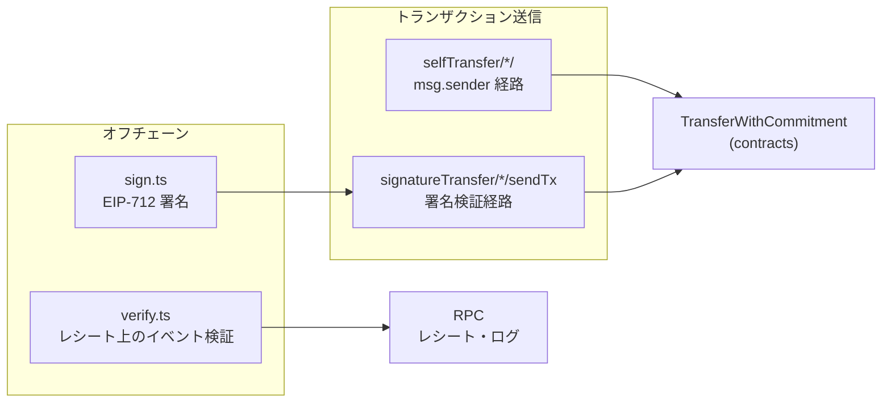

# 構成図

以下の構成図はオフチェーンとオンチェーンの役割の分離を示しています。

**図の要約（テキスト）**: Self-Call では送信者がコントラクトへ `transfer` を送り、Verifier はトランザクションのレシートからイベントをたどって検証します。Signature-Transfer では Executor が `transferWithAuthorization` を呼び、署名はオフチェーンの Signer が作成して Executor に渡します。どちらも `approve` → ERC-20 `transferFrom` → `TransferWithCommitmentSent` ログ、という流れが共通です。

## Self-Call

## Signature-Transfer

## SDK とコントラクトのつながり

次の図は **`sdk_js/SPEC.md`** に沿った、オフチェーン各モジュールとコントラクト・RPC の関係です。

- **Self-Call** — `selfTransfer` がコントラクトの `transfer` を直接呼ぶ。
- **Signature-Transfer** — 先に `sign` で EIP-712 署名し、`signatureTransfer` が `transferWithAuthorization` / `cancelAuthorization` を呼ぶ。
- **検証** — コントラクト呼び出しはせず、**RPC からレシートを取得**してイベントを解析する。

React / Rust SDK も、この JS モジュール境界に相当する API をそれぞれのランタイムでラップしています。

### データの流れ（概略）

1. **アプリ**が commitment をオフチェーンで決め、SDK 経由でコントラクトに送金を依頼する。
2. **コントラクト**が ERC-20 `transferFrom` とイベント発行、commitment の消費を行う。
3. **検証者**が RPC からレシートを取り、SDK の `verify` 相当でイベントと期待値を照合する。
