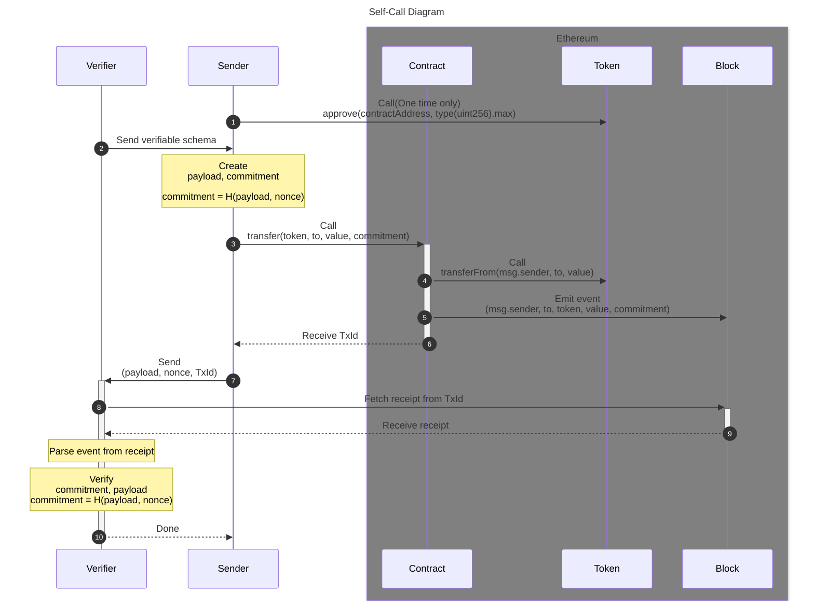
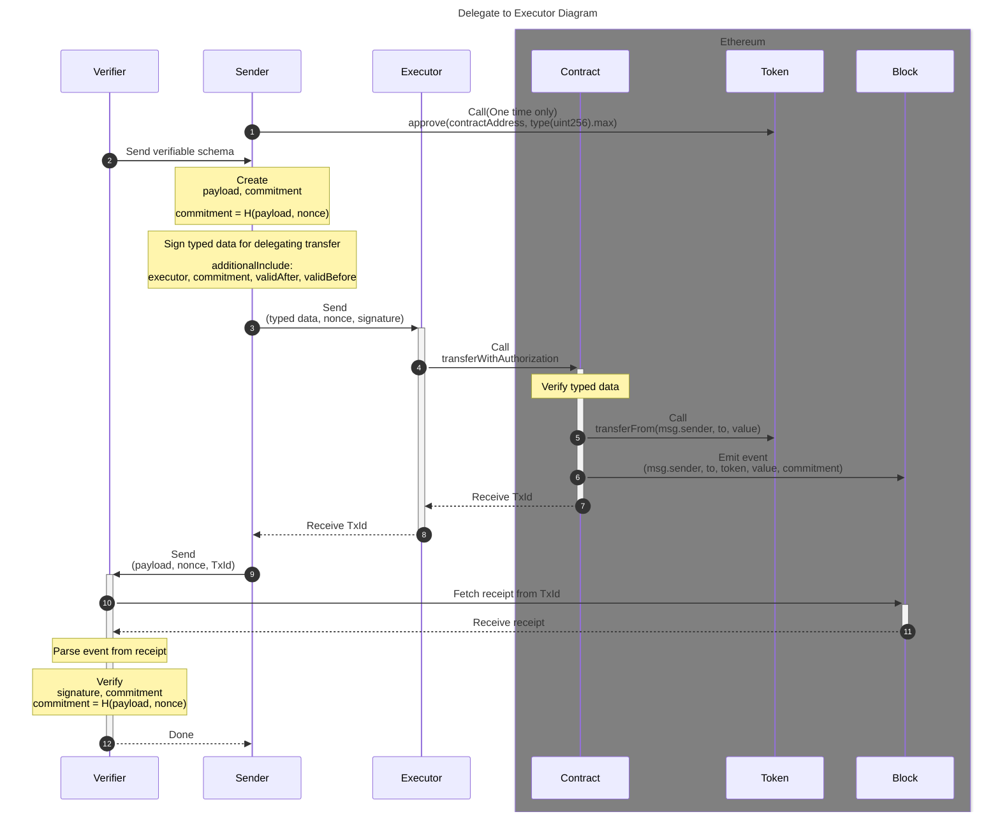
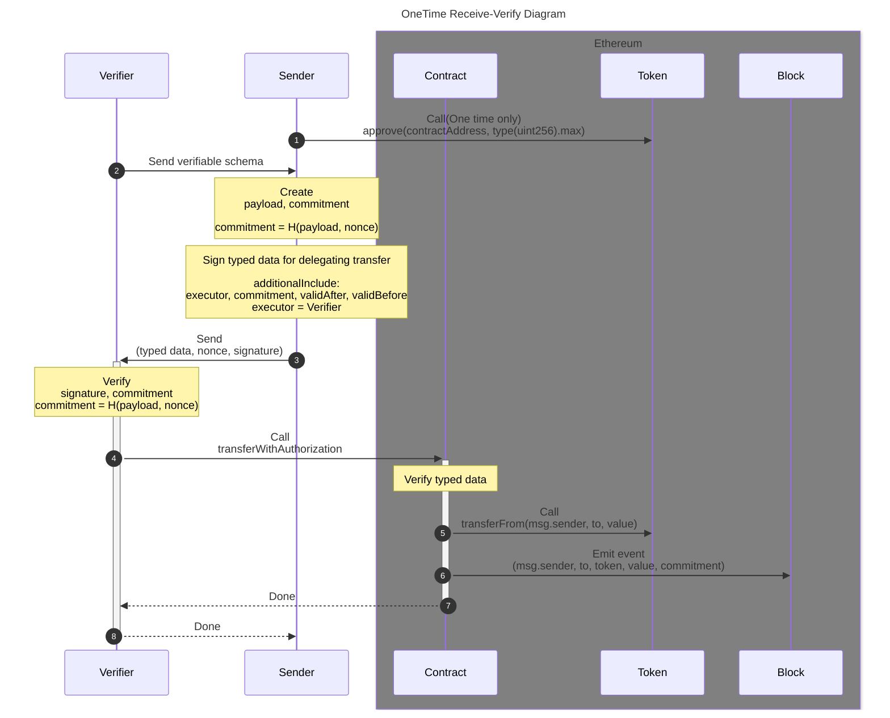

# シーケンス図

以下の 3 パターンが TWC の主要なシーケンスです。

## Self-Call

Self-Call フローでは **EIP-712 の型付きデータ署名は発生しません**（`transfer` には TWC への 1 回のトランザクション署名のみが必要）。オフチェーン検証は主に、イベントに含まれる `commitment` が payload から再現できるか、および受け取ったレシートが期待する TWC コントラクトからのものかを確かめます。

## Delegate to Executor

Executorに送金権限を移譲するフローです。EIP-712の型付きデータ署名を用いてExecutorがtxを実行するため、Senderはガスを第三者に肩代わりすることができます。

## One-Time Receive-Verify

VerifierがExecutorを兼任する場合は、commitmentの検証を通過し送金が成功するだけでいいので、Blockからreceipt取得し検証するフェーズをスキップできます。

## シナリオと実装手順

[シーケンス図](#シーケンス図)の **オフチェーン**参加者（Sender / Executor / Verifier）が、公式 SDK のチュートリアルで **どの見出しに相当するか**の導線です。

| シナリオ                | アクター                  | 主な作業                                                                        | JS                                                                                                                                                                                                                                | React                                                                                                                                                                                                                                      | Rust                                                                                                                                                                                                                                                            |
| ----------------------- | ------------------------- | ------------------------------------------------------------------------------- | --------------------------------------------------------------------------------------------------------------------------------------------------------------------------------------------------------------------------------- | ------------------------------------------------------------------------------------------------------------------------------------------------------------------------------------------------------------------------------------------ | --------------------------------------------------------------------------------------------------------------------------------------------------------------------------------------------------------------------------------------------------------------- |
| Self-Call               | Sender                    | `approve`・commitment・`transfer`                                               | [Step 1b](/sdk-js/guides/tutorial-self-call#step-1b--トークン-approve未だなら) · [Step 2](/sdk-js/guides/tutorial-self-call#step-2--commitment-を用意する) · [Step 3](/sdk-js/guides/tutorial-self-call#step-3--self-call-で送金) | [Step 1b](/sdk-react/guides/tutorial-self-call#step-1b--トークン-approve未だなら) · [Step 2](/sdk-react/guides/tutorial-self-call#step-2--commitment-を用意する) · [Step 3](/sdk-react/guides/tutorial-self-call#step-3--self-call-で送金) | [Step 2](/sdk-rust/guides/tutorial-self-call#step-2--commitment-を用意する) · [Step 3](/sdk-rust/guides/tutorial-self-call#step-3--self-call-で送金)（`approve` は [JS Step 1b](/sdk-js/guides/tutorial-self-call#step-1b--トークン-approve未だなら) 等を参照） |
| Self-Call               | Verifier                  | レシート照合（`TransferWithCommitmentSent`）                                    | [Tutorial: verify](/sdk-js/guides/tutorial-verify)                                                                                                                                                                                | [Tutorial: verify](/sdk-react/guides/tutorial-verify)                                                                                                                                                                                      | [Tutorial: verify](/sdk-rust/guides/tutorial-verify)                                                                                                                                                                                                            |
| Delegate to Executor    | Sender                    | EIP-712 署名                                                                    | [Step 1](/sdk-js/guides/tutorial-signature-executor#step-1--送金者側-署名)                                                                                                                                                        | [Step 1](/sdk-react/guides/tutorial-signature-executor#step-1--送金者側-署名)                                                                                                                                                              | [Step 1](/sdk-rust/guides/tutorial-signature-executor#step-1--送金者側-署名)                                                                                                                                                                                    |
| Delegate to Executor    | Executor                  | `transferWithAuthorization`                                                     | [Step 2](/sdk-js/guides/tutorial-signature-executor#step-2--executor-側-オンチェーン送信)                                                                                                                                         | [Step 2](/sdk-react/guides/tutorial-signature-executor#step-2--executor-側-オンチェーン送信)                                                                                                                                               | [Step 2](/sdk-rust/guides/tutorial-signature-executor#step-2--executor-側-オンチェーン送信)                                                                                                                                                                     |
| Delegate to Executor    | Verifier                  | レシート照合                                                                    | [Tutorial: verify](/sdk-js/guides/tutorial-verify)                                                                                                                                                                                | [Tutorial: verify](/sdk-react/guides/tutorial-verify)                                                                                                                                                                                      | [Tutorial: verify](/sdk-rust/guides/tutorial-verify)                                                                                                                                                                                                            |
| One-Time Receive-Verify | Sender                    | 署名を Verifier（= Executor）へ                                                 | [Step 1](/sdk-js/guides/tutorial-signature-executor#step-1--送金者側-署名)                                                                                                                                                        | [Step 1](/sdk-react/guides/tutorial-signature-executor#step-1--送金者側-署名)                                                                                                                                                              | [Step 1](/sdk-rust/guides/tutorial-signature-executor#step-1--送金者側-署名)                                                                                                                                                                                    |
| One-Time Receive-Verify | Verifier（Executor 兼任） | オフチェーン検証後に `transferWithAuthorization`（図では receipt 再取得を省略） | [Step 0](/sdk-js/guides/tutorial-signature-executor#step-0--送金者と-executor-の準備例) · [Step 2](/sdk-js/guides/tutorial-signature-executor#step-2--executor-側-オンチェーン送信)                                               | [Step 0](/sdk-react/guides/tutorial-signature-executor#step-0--送金者と-executor-の準備例) · [Step 2](/sdk-react/guides/tutorial-signature-executor#step-2--executor-側-オンチェーン送信)                                                  | [Step 0](/sdk-rust/guides/tutorial-signature-executor#step-0--送金者と-executor-の準備例) · [Step 2](/sdk-rust/guides/tutorial-signature-executor#step-2--executor-側-オンチェーン送信)                                                                         |

**Delegate / One-Time 共通**: クライアントと 2 役割の鍵の用意は [Step 0 — 送金者と Executor の準備（例）](/sdk-js/guides/tutorial-signature-executor#step-0--送金者と-executor-の準備例)（React / Rust も同一見出し）を参照してください。
