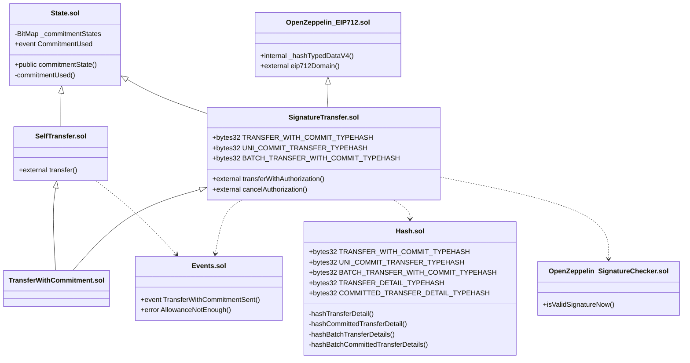

# クラス／継承図

> 図中の `OpenZeppelin_*.sol` は **`@openzeppelin/contracts` のライブラリ**を指す便宜表記であり、リポジトリ内の実ファイル名ではありません。

## ファイルと役割

| ファイル                     | 役割                                                                                                                                                 |
| ---------------------------- | ---------------------------------------------------------------------------------------------------------------------------------------------------- |
| `TransferWithCommitment.sol` | 最終派生。`SelfTransfer` と `SignatureTransfer` を継承。                                                                                             |
| `State.sol`                  | commitment のリプレイ防止（`BitMap` + `replayGuard`）。                                                                                              |
| `Events.sol`                 | `TransferWithCommitmentSent` `AllowanceNotEnough`を宣言。                                                                                            |
| `SelfTransfer.sol`           | Self-Callの実装コントラクト。`ReentrancyGuard`・`State`を継承。                                                                                      |
| `SignatureTransfer.sol`      | Signature-Transferの実装コントラクト。 `EIP712`・`ReentrancyGuard`・`State`を継承。 `Hash.sol`・`SignatureChecker`（EOA + ERC-1271）を利用。 |
| `Hash.sol`                   | EIP-712 TypeHash と明細のエンコード／ハッシュ。                                                                                                      |
