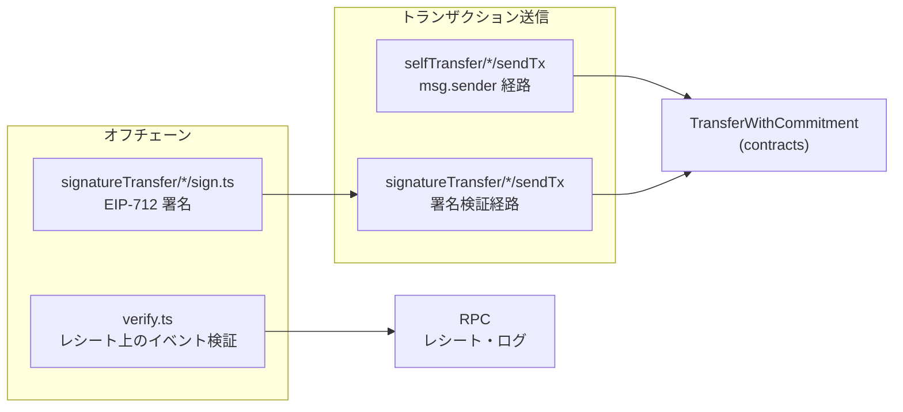

# SDK (JavaScript / TypeScript) IMPLEMENTATION

## Overview

`eth-twc-sdk-js` は、`TransferWithCommitment` コントラクト（`contracts` 配下の実装）を **viem** の `PublicClient` / `WalletClient` から呼び出すためのクライアント SDK である。EIP-712 署名には viem の `signTypedData` を用い、型・値の検証には **arktype** を用いる。npm 公開モジュールは **`package.json` の `exports` でサブパス分割**（variant-first：`eth-twc-sdk-js/signatureTransfer/single`、`eth-twc-sdk-js/selfTransfer/single` 等。**ルート一括エントリは無い**。以下の細部はソースの `signatureTransfer/*/…`・`selfTransfer/*/…` を正本として読み替える。

> **本文書との対応**: 後半のファイル見出しに旧パス（`sign.ts`、`sendTransaction/*`、`types/signedData`）が現れることがあります。実装レイアウトは上記ディレクトリ構造に移行済みです。`verify` の arktype 名は **`verifyArgsSchema`**。

- **オンチェーン EIP-712 ドメイン**: `signatureTransfer/*/sign.ts` は `assertTransferContractDeployed` → `getEip712Domain({ address: transferWithCommitmentAddress })` の流れ（ハードコードしたドメインは使わない）。`assertEip712DomainFromContractMatchesExpected` で `name` / `version` / `chainId` / `verifyingContract` を検証する。
- **EIP-712 domain と OpenZeppelin `EIP712` の整合**: ERC-5267 の `eip712Domain()` は `salt: bytes32(0)` を返しうるが、OpenZeppelin の `_buildDomainSeparator` は **name / version / chainId / verifyingContract のみ**（salt は domain separator に含めない）。viem の `hashTypedData` は `domain.salt` が存在すると salt 付きの `EIP712Domain` 型でハッシュするため、**`salt` がゼロワードのときは `domainForTypedDataSign` が署名前に `domain` から `salt` を除いて** `wallet.signTypedData` に渡す。戻り値の `domain` も同じ（ゼロ salt は含めない）。ゼロ以外の `salt` はそのまま渡す。
- **ABI**: `sdk_js/abi.ts` は `contracts/abi/generated` の再エクスポートであり、コントラクトと SDK の呼び出し整合を保つ。
- **チェーン / デプロイ**: SDK は **チェーン allowlist を持たない**。`assertPublicWalletSameChain` で両クライアントの `chain.id` を揃え、`assertTransferContractDeployed` で canonical アドレスにコードがあることを確認する。利用するネットワークの viem `chain` はアプリが wagmi / `createPublicClient` に渡す。
- **コントラクトアドレス**: `config.transferWithCommitmentAddress` は **`twcConstants.ts` の CREATE2 決定論アドレス**。ランタイム env で差し替える公開 API はない。バイトコード・salt・ctor を変えた場合はリポジトリ全体で値を更新する。

## Commitment（`bytes32`）の導出 — 利用者向け注意

本 SDK は **`commitment` を生成するヘルパを提供しない**。理由は、(1) 外部とランダム nonce を共有するスキームなど、**アプリ層のスキーマとの相互運用性**を SDK で固定しないため、(2) ハッシュ関数の選択を SDK に押し付けず、**ハッシュに関する単一障害点**にならないためである。

オフチェーンで `commitment` を導出するときは、利用者の責任で **暗号学的にランダムな `r`** と、用途に適した**安全なハッシュ関数 `H`** を選び、少なくとも **`commitment = H(message || r)`** の形（`message` はアプリのスキーマに従うバイト列）を満たすことを明示的に推奨する。`H` の具体（例: Keccak-256）や `message` のエンコードは、アプリと合意者間で定義する。

- ### `config.ts`

  `transferWithCommitmentAddress`・CREATE2 salt・EIP-712 定数を `twcConstants.ts` から再エクスポート（singleton factory アドレスは含めない）。

- ### `utils.ts`

  `chainIdToBig` — EIP-712 domain の `chainId` 正規化。`assertPublicWalletSameChain`（別名 `assertPublicWalletSameChain`）— 両クライアントの `chain.id` が揃っていることを検証。`assertTransferContractDeployed` — `eth_getCode`。`assertEip712DomainFromContractMatchesExpected` — オンチェーン domain と設定の整合。`assertSignedDomainMatchesClientAndConfig` — 署名済みバンドルの domain がクライアント・設定と一致すること。`assertSignerMatchesEip712Role` — 署名者と `from` / `authorizer` の一致。

- ### `types/utils.ts`

  arktype 用の `address` / `bytes32` / `bytes` / `uint256` および定数 `UINT256_MAX`。`uint256` は **`0n` 以上 `UINT256_MAX` 以下**の `bigint` のみ許容し、範囲外は拒否（メッセージに許容範囲を明示）。

- ### `types/transferDetail.ts`

  `TransferDetail`（`to`, `token`, `value`）および `CommittedTransferDetail`（上記に `commitment` を加えた形）の arktype スキーマ。

- ### `types/args/selfTransfer.ts` / `types/args/signatureTransfer.ts`

  Self-Call 用・署名用の各関数引数の arktype 定義と TypeScript 型エクスポート。**署名用**（`signatureTransfer`）では `validAfter` / `validBefore` を **`uint256.default(0n)` / `uint256.default(UINT256_MAX)`** として含み、単体転送・Uni・バッチで **`validAfter <= validBefore`** を `.narrow` で強制する。Uni / バッチ署名では **`details.length > 0`** も強制する。**Self-Call 用**（`selfTransfer`）では明細の長さ下限はスキーマで強制しておらず、空配列はコントラクト側で revert しうる。

- ### `types/args/verify.ts`

  `verify` 第 3 引数の `verifyArgs`（arktype）と `VerifyArgs` 型。`verify.ts` は内部で import するが **`verifyArgs` / `VerifyArgs` は export しない**（利用者は `types/args/verify` を import）。

- ### `types/signedData.ts`

  オフチェーンで転送する署名済みバンドルの arktype と型。各 `Signed*` に **`domain` を含む** — **`domain`** の TS 形状は **`signedDomainSchema`** の **`infer`**（`SignedBundleDomain`）であり、ゼロ `salt` が除去される場合はプロパティが無くなりうる。**実際に `sign.ts` が返す `domain`** は `domainForTypedDataSign` で正規化された後です（詳細は当該 `sign.ts` と `signatureTransfer/shared/domain.ts`）。メッセージ本体・`signature` に加え、チェーン・検証コントラクト等をバンドルに載せてルーティングや検証に使う。`sendTransaction/signatureTransfer` がコントラクトに渡す引数には含めない（付帯メタデータ）。単一・Uni・バッチの `Signed*`（Cancel 以外）では **時間窓**（`validAfter <= validBefore`）および Uni/Batch の **明細 1 件以上**を `.filter` で検証する。`signature` は **ERC-1271 等も考慮し長さは緩い** `bytes`（`types/utils` の `bytes`）としておく。

- ### `types/Eip712Type.ts`

  viem `signTypedData` 向けの `types` 定義（`TransferWithCommit`, `UniCommitTransfers`, `BatchTransferWithCommit`, `CancelAuthorization` および参照型）。

- ### `types/abi.ts`

  生成 ABI の再エクスポート。

- ### `sign.ts`

  コントラクトと同じ EIP-712 構造でウォレット署名を取得する。先頭で **`assertTransferContractDeployed`** と **`assertPublicWalletSameChain`** を実行し、続けて **`types/args/signatureTransfer` の `arktype.*.assert(args)`** で引数を検証する。その後 **`assertSignerMatchesEip712Role(account, …)`** で、`account`（署名者）がメッセージの **`from`**（単一・Uni・バッチ）または **`authorizer`**（キャンセル）と一致することを検証する（不一致なら **`getEip712Domain` / `signTypedData` に進まず**例外）。`assert` の戻り値（**デフォルト適用後**のオブジェクト）を `signTypedData` の `message` および戻り値に用いる（`validAfter` / `validBefore` を省略した入力でも `0n` / `UINT256_MAX` が埋まる）。`getEip712Domain` で得た `domain` に対し、上記のとおり **ゼロの `salt` は `signTypedData` 用に除去**したうえで署名し、**戻り値の `domain` に含めるのもその正規化後**（`signTypedData` に渡したオブジェクトと同一）。`validAfter` / `validBefore` は **`args` に含まれ**、スキーマ上デフォルトは `0n` と `UINT256_MAX`（`types/args/signatureTransfer` 参照）。`wallet.signTypedData` の `account` は**署名者のアドレス**であり、EIP-712 メッセージの `from`（または `authorizer`）と**一致している必要がある**（上記の事前チェックで強制）。

- ### `verify.ts`

  **`getTransferWithCommitmentSentEventLogs`** は先頭で **`assertTransferContractDeployed`** を実行する。**`verify`** は **`types/args/verify` の `verifyArgs.assert(args)` を最優先**し、失敗時はスキーマ例外。成功後に **`assertTransferContractDeployed`** を行う。レシートから `TransferWithCommitmentSent` を `parseEventLogs` で抽出したうえで、**`log.address` が `transferWithCommitmentAddress` と一致するログ**（大小文字を区別しない比較）に限定する。**`verify`** は `args` によるデコード絞り込みのあと上記アドレスフィルタを行い、**該当が 0 件なら例外**。**`getTransferWithCommitmentSentEventLogs`** は `args` による絞り込みは行わず、イベント名でパースした結果を **`transferWithCommitmentAddress` のみにフィルタ**して返す（0 件なら空配列、例外にしない）。成功時の **`verify`** は **`Promise<void>` の履行**のみ。レシート取得失敗・スキーマ不正・**TWC 未デプロイ**・chain 未設定などは**例外**。

- ### `sendTransaction/selfTransfer.ts`

  各関数の先頭で **`assertTransferContractDeployed`** と **`assertPublicWalletSameChain`** を実行し、続けて **`types/args/selfTransfer` の `arktype.*.assert(args)`** で引数を検証する。`msg.sender` が送金者となる `transfer` の各オーバーロードに対応。`simulateContract` 後に `writeContract`。引数の `account` は**トランザクション送信者**（`msg.sender`）であり、送金元と一致する必要がある。Uni / バッチの明細の長さ下限は **署名用スキーマとは異なり**、Self-Call 用 arktype では強制しておらず、空配列を渡すとコントラクト側で revert しうる。

- ### `sendTransaction/signatureTransfer.ts`

  署名付き `transferWithAuthorization` / `cancelAuthorization` に対応。各関数の先頭で **`assertTransferContractDeployed`**、**`assertPublicWalletSameChain`**、**`assertSignedDomainMatchesClientAndConfig`**（`domain.chainId` とクライアントチェーン、`domain.verifyingContract` と `transferWithCommitmentAddress`）を実行する。明細配列は ABI 向けに `to` / `token` / `value`（および Committed では `commitment`）へマッピングする。`account` は**実行者（executor）**として `msg.sender` になり、EIP-712 上の `executor` と一致している必要がある（不一致ではシミュレーション／実行が失敗する）。バッチ明細の空配列も同様にコントラクトで reject されうる。**本モジュールは `types/signedData` の arktype を呼び出さない**（型は `Signed*` によりコンパイル時に担保；オフチェーン JSON から復元する場合は呼び出し側で `types/signedData` のスキーマ利用を推奨）。

## Requirements

以下は `sdk_js` ソースに基づく、公開 API の**前提条件**・**事後条件**・**アクション**の定義である。viem の型・RPC エラーは各関数の外因として扱う。

---

### `config.ts`

| 対象                            | 説明 |
| ------------------------------- | ---- |
| `transferWithCommitmentAddress` | CREATE2 決定論アドレス（`twcConstants.ts`） |
| CREATE2 salt / EIP-712 定数     | `TRANSFER_WITH_COMMITMENT_CREATE2_SALT`、`EIP712_DOMAIN_*`（factory アドレスは SDK 外） |

※ ランタイムの「ゼロアドレス」ガードは **パッケージでは未使用**（既定は常に非ゼロの canonical アドレス）。

---

### `utils.ts`

| 対象                                                          | 説明 |
| ------------------------------------------------------------- | ---- |
| `assertTransferContractDeployed`                              | `eth_getCode` で canonical アドレスにコードがあるか |
| `chainIdToBig`                                                | `number` / `bigint` → `bigint` |
| `assertPublicWalletSameChain`（別名 `…SameSupportedChain`）    | 両クライアントに同じ `chain.id` |
| `assertEip712DomainFromContractMatchesExpected`               | オンチェーン domain と期待値の整合 |
| `assertSignedDomainMatchesClientAndConfig`                    | 署名バンドル domain とクライアント・config |
| `assertSignerMatchesEip712Role`                               | 署名者と `from` / `authorizer` |

---

### `sign.ts`

`assertTransferContractDeployed` が成功すること。`assertPublicWalletSameChain` が成功すること（満たさなければ `Chain is not set...` または chain mismatch、または **TWC 未デプロイ**の `Error`）。`arktype.*.assert(args)` が成功すること（`args` は `types/args/signatureTransfer` のスキーマに従い、**省略フィールドは assert 戻り値でデフォルト埋め**）。**`account` が assert 後の `from`（単一・Uni・バッチ）または `authorizer`（キャンセル）と一致すること**（満たさなければ `Signer account (...) does not match EIP-712 message ...` の `Error`；大小文字は無視）。また `getEip712Domain` が成功し、ウォレットが `signTypedData` に応答できること。`getEip712Domain().domain` の `salt` が **ゼロワード**の場合、オンチェーン domain separator と一致させるため **`signTypedData` には `salt` キーを付けない**（戻り値の `domain` も同様）。

| 対象                                                  | 前提条件                                                                                                                                                                                                                                                                | 事後条件                                                                                                                  | アクション                             |
| ----------------------------------------------------- | ----------------------------------------------------------------------------------------------------------------------------------------------------------------------------------------------------------------------------------------------------------------------- | ------------------------------------------------------------------------------------------------------------------------- | -------------------------------------- |
| `singleTransfer(publicClient, wallet, account, args)` | `SingleTransferArgs`（`validAfter` / `validBefore` は省略可・デフォルト `0n` / `UINT256_MAX`；`validAfter <= validBefore`）；**`account` と `args.from` が同一アドレス（大小無視）**                                                                                    | `SignedTransferWithCommit` 相当（`domain`, `validAfter`, `validBefore`, `signature` 等）を返す。`domain` は上記の正規化後 | `TransferWithCommit` 型で EIP-712 署名 |
| `uniCommitTransfers(...)`                             | `UniCommitTransfersArgs`；`details` は 1 件以上、`validAfter` / `validBefore` は上記同様；**`account` と `args.from` が同一アドレス（大小無視）**                                                                                                                       | `SignedUniCommitTransfers` 相当（`domain` を含む）を返す。`domain` は正規化後                                             | `UniCommitTransfers` 型で署名          |
| `batchTransferWithCommit(...)`                        | `BatchTransferWithCommitArgs`；`details` は 1 件以上、`batchCommitment` はバッチ全体の識別子（オンチェーン `replayGuard(from, batchCommitment)` と EIP-712 に含める）；`validAfter` / `validBefore` は上記同様；**`account` と `args.from` が同一アドレス（大小無視）** | `SignedBatchTransferWithCommit` 相当（`domain` を含む）を返す。`domain` は正規化後                                        | `BatchTransferWithCommit` 型で署名     |
| `cancelAuthorization(...)`                            | `CancelAuthorizationArgs`；**`account` と `args.authorizer` が同一アドレス（大小無視）**                                                                                                                                                                                | `SignedCancelAuthorization` 相当（`domain` を含む）を返す。`domain` は正規化後                                            | `CancelAuthorization` 型で署名         |

---

### `verify.ts`

| 対象                                                         | 前提条件                                                                                              | 事後条件                                                                                                                         | アクション                                                                                               |
| ------------------------------------------------------------ | ----------------------------------------------------------------------------------------------------- | -------------------------------------------------------------------------------------------------------------------------------- | -------------------------------------------------------------------------------------------------------- |
| `getTransferWithCommitmentSentEventLogs(publicClient, hash)` | `assertTransferContractDeployed`；レシート取得可能                                    | **`transferWithCommitmentAddress` が emit した** `TransferWithCommitmentSent` のみの配列（該当なしなら**空配列**；例外にしない） | `getTransactionReceipt` → `parseEventLogs` → コントラクトアドレスでフィルタ（`args` による絞り込みなし） |
| `verify(publicClient, hash, args)`                           | `verifyArgs.assert(args)` 成功後に `assertTransferContractDeployed`；レシート取得可能 | **`args` に一致し**かつ **`transferWithCommitmentAddress` から発火**したログが 1 件以上なら**正常終了**（`Promise<void>`）       | `parseEventLogs`（`args` 指定）→ **`log.address` をコントラクトアドレスでフィルタ**                      |
| `verify`（失敗時）                                           | 検証失敗                                                                                              | `Error`（スキーマ、**TWC 未デプロイ**、**一致ログなし（アドレスまたは内容）**）                                 | 例外を投げる                                                                                             |

---

### `sendTransaction/selfTransfer.ts`

`assertTransferContractDeployed` および `assertPublicWalletSameChain` が成功すること。続けて **`types/args/selfTransfer` の `arktype.*.assert(args)`** が成功すること。`simulateContract` が成功し、`wallet.writeContract` が完了することを前提とする（失敗時は viem が reject）。

| 対象                                                    | 前提条件                                                                                     | 事後条件                                                                      | アクション                                             |
| ------------------------------------------------------- | -------------------------------------------------------------------------------------------- | ----------------------------------------------------------------------------- | ------------------------------------------------------ |
| `transfer(..., args: SingleTransferArgs)`               | 上記チェーン検証・arktype；`account` がトランザクション送信者；コントラクト側の allowance 等 | `transfer(token, to, value, commitment)` が実行されたトランザクションハッシュ | `functionName: "transfer"`（4 引数）                   |
| `unifiedTransfer(..., args: UniCommitTransfersArgs)`    | 上記チェーン検証・arktype；同上                                                              | `transfer(details, commitment)` が実行される                                  | `functionName: "transfer"`（2 引数・ユニファイド明細） |
| `batchTransfer(..., args: BatchTransferWithCommitArgs)` | 上記チェーン検証・arktype；同上                                                              | `transfer(details)`（`CommittedTransferDetail[]`）が実行される                | `functionName: "transfer"`（1 引数）                   |

---

### `sendTransaction/signatureTransfer.ts`

`simulateContract` 前に `assertTransferContractDeployed`、`assertPublicWalletSameChain`、`assertSignedDomainMatchesClientAndConfig` を実行する（満たさなければ **TWC 未デプロイ**、chain 未設定 / mismatch / `domain` 不一致の `Error`）。

| 対象                                                              | 前提条件                                                                       | 事後条件                                                                                                                       | アクション                                                                 |
| ----------------------------------------------------------------- | ------------------------------------------------------------------------------ | ------------------------------------------------------------------------------------------------------------------------------ | -------------------------------------------------------------------------- |
| `singleTransfer(..., signedData: SignedTransferWithCommit)`       | 上記検証；署名がオンチェーン検証に通り、時刻・コミットメント・allowance が有効 | `transferWithAuthorization(from, to, token, value, validAfter, validBefore, commitment, signature)` が実行される               | 8 引数オーバーロード（コントラクト引数に `domain` は含めない）             |
| `unifiedTransfer(..., signedData: SignedUniCommitTransfers)`      | 同上                                                                           | `transferWithAuthorization(from, details, validAfter, validBefore, commitment, signature)`（`TransferDetail[]`）               | 明細から `commitment` を除いた形でエンコード                               |
| `batchTransfer(..., signedData: SignedBatchTransferWithCommit)`   | 同上                                                                           | `transferWithAuthorization(from, details, validAfter, validBefore, batchCommitment, signature)`（`CommittedTransferDetail[]`） | 各明細に `commitment` を含め、`batchCommitment` をトップレベルでエンコード |
| `cancelAuthorization(..., signedData: SignedCancelAuthorization)` | 同上                                                                           | `cancelAuthorization(authorizer, commitment, signature)` が実行される                                                          | 3 引数                                                                     |

---

### Specification

- **コントラクト仕様との対応**

  SDK が呼び出す関数・EIP-712 型名・フィールド順は、`contracts/SPEC.md` および Solidity の `SignatureTransfer` / `SelfTransfer` / `Hash.sol` と一致させる。メッセージハッシュ用の **domain separator** は OpenZeppelin `EIP712`（`name` / `version` / `chainId` / `verifyingContract`）と一致する必要があり、`sign.ts` はゼロ `salt` を署名用 `domain` から除いてこれを満たす。ERC-5267 が返す `salt` の生値は RPC 上は取得できても、署名計算では上記のとおり正規化する。

- **署名と送信の分離**

  `sign.ts` は EIP-712 署名のみ。`sendTransaction/signatureTransfer.ts` は**署名済みバンドル**に基づく `transferWithAuthorization` / `cancelAuthorization` の送信のみ。`sendTransaction/selfTransfer.ts` は **`msg.sender` 送金（`transfer`）** のみ。オフチェーンで署名を生成し、別の executor が `writeContract` する運用は署名経路で想定できる。

- **チェーンとデプロイ**

  チェーン **allowlist は無い**。`assertPublicWalletSameChain` でクライアント整合を取り、`assertTransferContractDeployed` で canonical アドレスにコードがあることを確認する。`sendTransaction/signatureTransfer` では `domain.chainId` / `domain.verifyingContract` も検証する。

- **検証（verify）の位置づけと限界**

  `verify` は、**信頼できる RPC** から取得したレシート上で、`TransferWithCommitmentSent` が指定の `from` / `token` / `to` / `value` / `commitment` と一致し、かつ **`transferWithCommitmentAddress` が emit したログ**（アドレスは大小文字を区別しない比較）であることを少なくとも 1 件確認する。成功時は履行のみで戻り値はない。`getTransferWithCommitmentSentEventLogs` は **トランザクションハッシュのみ**分かっている場合に、当該コントラクト由来のイベントを列挙するのに使える（`args` による内容照合はしない）。トランザクションの最終性、チェーン ID の取り違え、別フォーク上のハッシュ、ログの改ざん（悪意ある RPC）などは**防がない**。複数件マッチした場合の意味（例: バッチ送金で同一ペイロードが複数回）の解釈は呼び出し側の責務である。

- **型と実行時**

  `types/*` の arktype は **`sign.ts` / `sendTransaction/selfTransfer.ts` / `verify.ts` で `assert` により実行時検証**される（`sign.ts` は **assert の戻り値**でデフォルト適用後のフィールドを利用する）。`sign.ts` の戻り値は `types/signedData` の `Signed*` 型に一致するよう組み立てる。`domain` は **`getEip712Domain` の生の `domain` ではなく**、署名に使った正規化後（ゼロ `salt` 除去後）を含め、オフチェーン転送時にチェーン・`verifyingContract` 等を自己記述できる。EIP-712 メッセージ入力用の `args` に含まれるが署名済みバンドルに含めないフィールド（例: `executor`）は戻り値に含めない。

- **依存関係**

  **viem**（クライアント・コントラクト呼び出し）、**arktype**（スキーマ）。`package.json` の **peerDependencies** に **TypeScript 5** を記載するが **optional** とし、純 JS 利用時は必須としない。

- **コントラクト側の制約の継承**

  手数料・リベース型 ERC20、耐量子署名の扱い、immutable な検証実装など、`contracts/SPEC.md` の Specification に書かれた制約は SDK 単体では緩和されない。

- **明細配列 `details` の長さ（上限はアプリ側）**

  バッチ／ユニファイド経路では `details` の要素数にコントラクト上の上限はなく（`contracts/SPEC.md` の同項目参照）、明細が多い・途中で revert するなどの場合に **executor または `msg.sender` がガス負担を増やす**可能性がある。本 SDK は明細数の上限を強制しない。適切な件数や送信前の `simulateContract` 等による検証は、**呼び出し側アプリケーションの裁量**とする。
