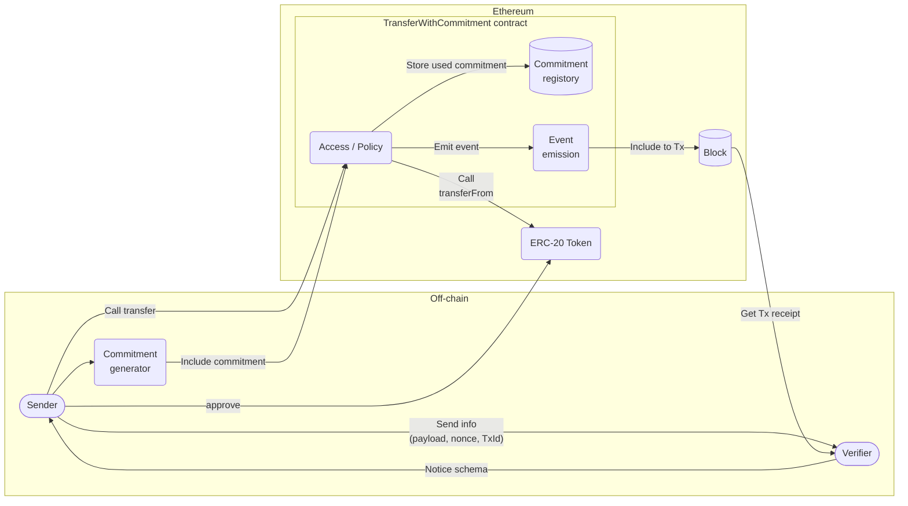
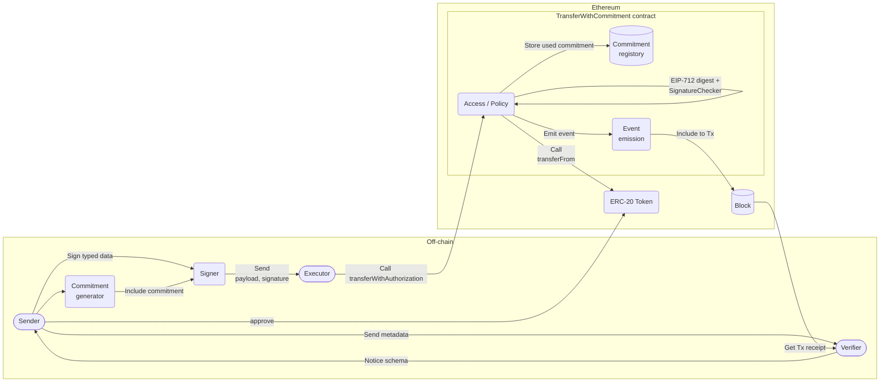

# TransferWithCommitment JavaScript SDK — 利用者向けガイド

プロトコル全体の説明・制約・用語は、リポジトリルートの [README.md](../../README.md) を参照してください。ここでは **SDK をどう組み込むか** に絞ります。

- **パッケージ名**: `eth-twc-sdk-js`
- **ベース**: [viem](https://viem.sh/) の `PublicClient` / `WalletClient`
- **サブパス import** のみ（例: `eth-twc-sdk-js/selfTransfer/single`）。ルートの一括エントリはありません。

---

## プロトコル上の 2 経路（図）

ルート README の **Self-Call** と **Signature-Transfer** は、オンチェーンで呼ぶ関数が異なります。

| 経路 | 送信者の操作 | コントラクト |
|------|----------------|--------------|
| Self-Call | 自分のウォレットで `transfer(...)` を直接呼ぶ | `transfer` |
| Signature-Transfer | オフチェーンで EIP-712 署名し、**Executor** が `transferWithAuthorization(...)` を呼ぶ | `transferWithAuthorization` |

### Self-Call（概念図）



### Signature-Transfer（概念図）



---

## Commitment（`bytes32`）の導出

本 SDK は **`commitment` を生成するヘルパを提供しない**。外部プロトコル（例: Nostr）とランダム nonce を共有するスキームとの**相互運用性**をアプリで選べるようにし、かつハッシュ関数の選択を SDK に固定して**安全性の単一障害点**にならないようにするためである。

利用者はオフチェーンで **`commitment` を導出する責任**を負う。少なくとも **暗号学的にランダムな `r`** と **安全なハッシュ関数 `H`** を用いて、

**`commitment = H(message || r)`**

（`message` はアプリのスキーマに従うバイト列）とすることを明示的に推奨する。`H` の具体や `message` のエンコードはアプリと合意者間で定義する。

---

## 想定する操作と使用例

以下は **SDK がカバーする役割** を示す最小例です。`commitment` の作り方は上記のとおりアプリの責任であり、例ではプレースホルダとしています。

### 共通の前提

1. **`config.transferWithCommitmentAddress`** が指す **CREATE2 canonical TWC** が、接続チェーンにデプロイ済みであること（未デプロイでは `eth_getCode` で API が失敗します）。
2. **`PublicClient` / `WalletClient` に `chain`（`chain.id`）が設定**されていること。
3. ERC-20 について、**送信者が TWC コントラクトに `approve` 済み**であること（ルート README のシーケンスどおり、通常は一度限りの十分な額）。

```typescript
import { createPublicClient, createWalletClient, http } from "viem";
import { mainnet } from "viem/chains";
import { privateKeyToAccount } from "viem/accounts";

// 例: クライアント作成（実際の RPC・鍵は環境に合わせてください）
const publicClient = createPublicClient({ chain: mainnet, transport: http() });
const account = privateKeyToAccount("0x…");
const walletClient = createWalletClient({ account, chain: mainnet, transport: http() });
```

---

### 1. Self-Call — 送信者が自分で `transfer` を送る

ルート README の **Self-Call** シーケンスに対応します。**EIP-712 署名は不要**です。`eth-twc-sdk-js/selfTransfer/single` の `sendTx` がコントラクトの `transfer(token, to, value, commitment)` に相当します。

```typescript
import { sendTx } from "eth-twc-sdk-js/selfTransfer/single";
import { verify } from "eth-twc-sdk-js/verify";
import type { Hex } from "viem";

const token = "0x…" as Hex;
const to = "0x…" as Hex;
const value = 1_000_000n;
const commitment = "0x…" as Hex;

const txHash = await sendTx(publicClient, walletClient, account.address, {
  token,
  to,
  value,
  commitment,
});

await publicClient.waitForTransactionReceipt({ hash: txHash });

await verify(publicClient, txHash, {
  from: account.address,
  token,
  to,
  value,
  commitment,
});
```

**バッチ・Unified（Self-Call）** は `selfTransfer/batch`、`selfTransfer/unified` の **`sendTx`** を使います。

---

### 2. Delegate to Executor — 署名して Executor が `transferWithAuthorization`

1. **送信者**が `signatureTransfer/*/sign` で EIP-712 署名済みバンドルを取得する。
2. **Executor** が **`signatureTransfer/*/sendTx`** でトランザクションを送信する（ガスは Executor 負担）。
3. 検証は `verify`。

```typescript
import {
  sign,
  sendTx,
  signedDataSchema,
  type SignedSingleTransfer,
} from "eth-twc-sdk-js/signatureTransfer/single";
import { verify } from "eth-twc-sdk-js/verify";
import type { Hex } from "viem";

const signed: SignedSingleTransfer = await sign(
  publicClient,
  senderWallet,
  sender.address,
  {
    from: sender.address,
    to: recipient,
    token,
    executor: executor.address,
    value,
    commitment,
  },
);

// wire 復元など I/O が挟まるなら検証してから送信
signedDataSchema.assert(signed);

const txHash = await sendTx(
  publicClient,
  executorWallet,
  executor.address,
  signed,
);
```

Uni / Batch / Cancel は **`signatureTransfer/unified`、`/batch`、`/cancelAuthorization`** の `sign` / `sendTx` を同様に使います。

---

### 3. One-Time Receive-Verify（Verifier が executor）

署名メッセージの **`executor` を Verifier（検証者）自身のアドレスに固定**し、Verifier のウォレットで `transferWithAuthorization` を呼ぶパターン。**§2 と同じ公開 API**で、`executor` と `signatureTransfer/*/sendTx` に使う `WalletClient` を Verifier に揃えます。

---

## 設定 (`config`)

| エクスポート | 説明 |
|--------------|------|
| `transferWithCommitmentAddress` | CREATE2 決定論アドレス（`twcConstants.ts`）。接続チェーンで **コードが無い**と各 API は失敗します。 |
| CREATE2 / EIP-712 定数 | `TRANSFER_WITH_COMMITMENT_CREATE2_SALT`、`EIP712_DOMAIN_*` など（singleton factory は `contracts` 側） |

```typescript
import { transferWithCommitmentAddress } from "eth-twc-sdk-js/config";
```

---

## API リファレンス

### EIP-712 署名 — `eth-twc-sdk-js/signatureTransfer/*/sign`

送信者側。各ファイルで **`sign`** が exportされます。共通で `argsSchema.assert`、`domainForTypedDataSign`（ゼロ salt 除去）、`signTypedData` を経由します。「Uni」相当は公開サブパス **`signatureTransfer/unified`**（primaryType は `UniCommitTransfers`）。

### Self-Call 送信 — `eth-twc-sdk-js/selfTransfer/*`

送信者が **自分で** `simulateContract` → `writeContract`。各 **`sendTx`** の先頭で `argsSchema.assert`。

### Executor 送信 — `eth-twc-sdk-js/signatureTransfer/*/sendTx`

`transferWithAuthorization` / `cancelAuthorization`。オフチェーンでは **`signedDataSchema`** による検証を推奨。

### `eth-twc-sdk-js/abi`

ABI の再エクスポート。

### `eth-twc-sdk-js/verify`

| 関数 | 説明 |
|------|------|
| `verify(publicClient, txHash, args)` | `verifyArgsSchema.assert(args)` が最優先。その後 **TWC デプロイ確認**（`getCode`）、レシート照合。 |
| `getTransferWithCommitmentSentEventLogs(publicClient, txHash)` | 該当コントラクトからのイベントログのみ。**0 件は空配列**。 |

スキーマ `verifyArgsSchema` と型 `VerifyArgs` は **`eth-twc-sdk-js/verify`** から export されています。

**注意**: 検証は RPC が返すレシートに依存します。信頼できる RPC・確定ブロック数などは運用で担保してください（[sdk_js/README.md](../README.md) のセキュリティ節）。

---

### `eth-twc-sdk-js/utils`

| 関数 | 説明 |
|------|------|
| `assertTransferContractDeployed(publicClient, address?)` | canonical アドレス（省略時は config）に `eth_getCode` でコードがあるか。 |
| `chainIdToBig(id)` | `number` / `bigint` を `bigint` に統一。 |
| `assertPublicWalletSameChain(publicClient, wallet)`（別名 `…SameSupportedChain`） | 両方に同じ `chain.id`。 |
| `assertEip712DomainFromContractMatchesExpected` | オンチェーン `eip712Domain` と期待値の整合。 |
| `assertSignedDomainMatchesClientAndConfig(publicClient, domain, configuredContract)` | 署名バンドルの domain がクライアントと `config` と一致するか。 |

---

### 型・共通（抜粋）

| サブパス | 内容 |
|----------|------|
| `signatureTransfer/<variant>` | **`argsSchema`**, **`signedDataSchema`**, **`eip712Types`**, 型一式。 |
| `selfTransfer/<variant>` | **`argsSchema`**, **`sendTx`** 入力型。 |
| `abi` | コントラクト ABI |
| `types/utils` | スカラー arktype と `Hex0x`, `UINT256_MAX`。 |
| `types/transferDetail` | `transferDetail`, `committedTransferDetail`（Self / 署名の双方で利用）。 |

---

## 関連ドキュメント

- [sdk_js/README.md](../README.md) — インストール・設定・セキュリティ注意
- [sdk_js/SPEC.md](../SPEC.md) — 型・EIP-712・コントラクトとの対応の詳細
- [リポジトリルート README.md](../../README.md) — プロトコル要件・シーケンス図
